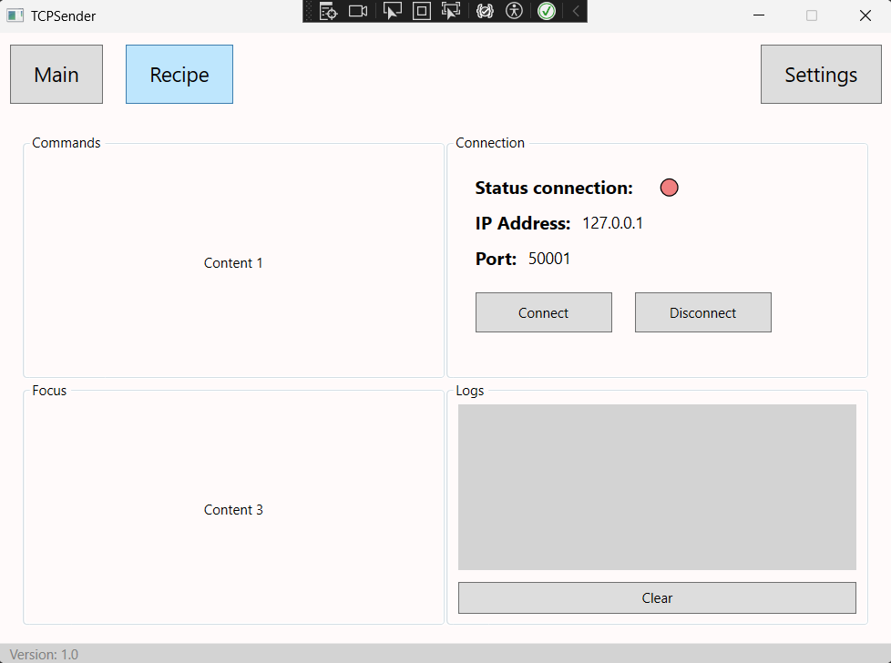
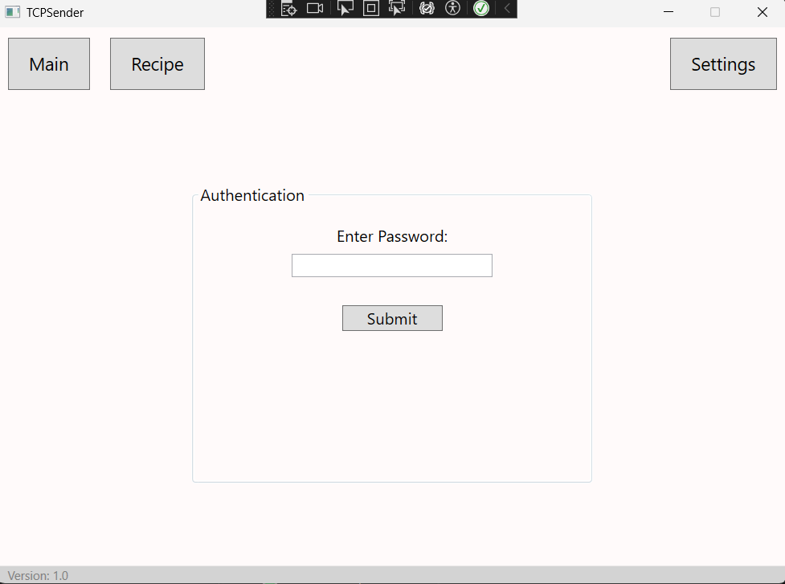
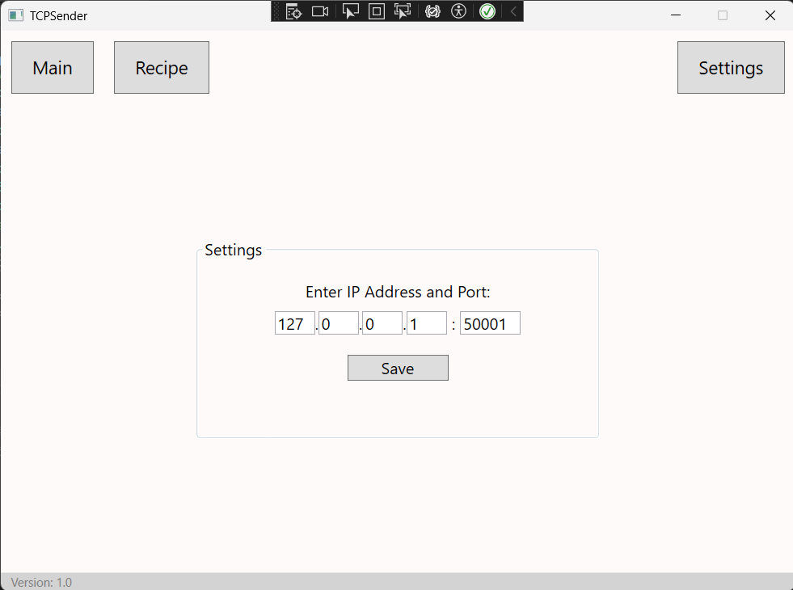

# WPF TCP Command Sender

Aplikacja desktopowa stworzona w technologii **WPF (.NET)**, umożliwiająca nawiązywanie połączeń TCP z urządzeniami (np. sterownikami PLC, serwerami itp.) oraz wysyłanie do nich komend tekstowych lub binarnych.

## ✨ Funkcje

- Połączenie z serwerem TCP poprzez IP i port
- Wysyłanie komend tekstowych lub binarnych
- Odbieranie odpowiedzi z serwera
- Historia wysłanych komend
- Interfejs graficzny w WPF (C#)
- Obsługa błędów połączenia i timeoutów

## 🖼️ Zrzuty ekranu





## 🔧 Wymagania

- .NET 8
- Windows 10/11

## 🚀 Uruchomienie

1. Sklonuj repozytorium:
   ```bash
   git clone https://github.com/twoj-login/twoj-projekt.git
